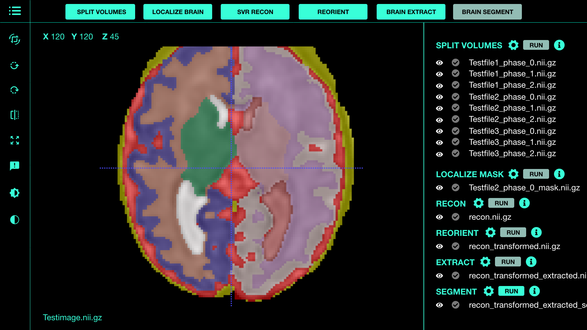

Clinical MRI has become an indispensable clinical tool for precise diagnosis of fetal and neonatal brain disorders. The advent of ultrafast MRI acquisitions has enabled clinicians to largely overcome challenges of fetal motion and resulting image degradation. Concurrent with in vivo fetal ultrafast MR imaging, there has been an exponential development of innovative image-processing techniques that are enabling us to precisely measure the exuberant growth and organizational processes of the developing brain in the womb, which in turn is allowing us to identify the earliest deviations from normal in the high-risk fetus. The unprecedented growth of normative data and the capability of hardware & software algorithms to harness big data at an ultra-high speed are facilitating early and advanced diagnostic capabilities in the high-risk pregnancy. Taken together, these technological advancements are effortlessly removing current roadblocks for the clinical adoption of quantification of fetal MRI data in the clinical setting, which in the past has required intensive labor for image processing to get reliable measurements. Integrated Research Information System (IRIS) is a state-of-art cross-platform research application that can be used to bring advanced neuroimaging research applications to real-time diagnoses.

